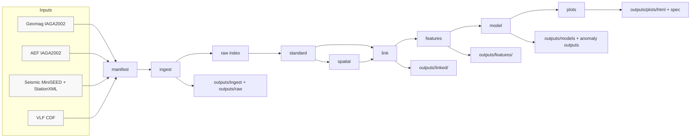
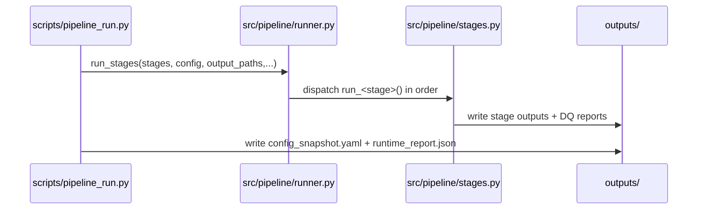

# 02 Architecture

Purpose / Reader / Takeaways:
- Purpose: describe the system architecture, data flow, and control flow with verifiable links to code.
- Reader: engineers who need a mental model of how data moves and which modules own each step.
- Takeaways: staged pipeline, layered storage, and API surface mapped to outputs.

## System Overview
Core components:
- CLI runner orchestrates ordered stages and writes run timing + config snapshot.
- Pipeline stages implement manifest -> ingest -> raw -> standard -> spatial -> link -> features -> model -> plots.
- Output layout is centralized in `src/store/paths.py` and used across stages.
- FastAPI app exposes raw/standard queries, event outputs, and UI with static output mounts.
- [EVIDENCE] scripts/pipeline_run.py:L22-L83
- [EVIDENCE] src/pipeline/runner.py:L11-L82
- [EVIDENCE] src/store/paths.py:L6-L35
- [EVIDENCE] src/api/app.py:L20-L26

## Data Flow (Mermaid)

Why each node exists:
- Manifest scans input files and records metadata/hashes for reproducibility.
  - [EVIDENCE] src/pipeline/manifest.py:L23-L69
- Ingest parses raw formats into structured tables and VLF Zarr cubes.
  - [EVIDENCE] src/pipeline/ingest.py:L45-L195
- Raw builds queryable index for raw sources (supports `/raw/query`).
  - [EVIDENCE] src/pipeline/raw.py:L40-L151
  - [EVIDENCE] src/api/app.py:L492-L597
- Standard cleans and standardizes per-source data (geomag/aef/seismic/vlf features).
  - [EVIDENCE] src/pipeline/standard.py:L206-L745
- Spatial builds station index and spatial DQ.
  - [EVIDENCE] src/pipeline/spatial.py:L40-L66
- Link aligns by event window/time interval and spatial radius into linked dataset.
  - [EVIDENCE] src/pipeline/link.py:L30-L135
- Features compute per-event statistics and arrival proxies.
  - [EVIDENCE] src/pipeline/features.py:L38-L150
- Model scores anomalies and association signals.
  - [EVIDENCE] src/pipeline/model.py:L204-L293
- Plots generate Plotly spec + HTML for UI.
  - [EVIDENCE] src/pipeline/plots.py:L24-L140

## Control Flow (Mermaid)

Control flow evidence:
- CLI collects config, computes params_hash, writes config snapshot + runtime report.
  - [EVIDENCE] scripts/pipeline_run.py:L35-L83
- Stage order and dispatch table are enforced in runner.
  - [EVIDENCE] src/pipeline/runner.py:L11-L82
- Stage wiring is centralized in `src/pipeline/stages.py`.
  - [EVIDENCE] src/pipeline/stages.py:L6-L43

## API + UI Architecture
- API mounts output directory as static files and serves query endpoints.
  - [EVIDENCE] src/api/app.py:L20-L26
- Raw queries read the raw index and original files; VLF uses catalog/slice logic.
  - [EVIDENCE] src/api/app.py:L492-L628
- Standard queries read partitioned parquet from `outputs/standard/source=<source>`.
  - [EVIDENCE] src/api/app.py:L631-L667
- Event endpoints expose linked/features/anomaly/plots and export bundles.
  - [EVIDENCE] src/api/app.py:L718-L977
- UI renders templates with event metadata, plots, and previews.
  - [EVIDENCE] src/api/app.py:L980-L1034

## Output Layout Contract
The output directory schema is defined once and used across stages.
- [EVIDENCE] src/store/paths.py:L6-L35

Sample outputs in this workspace (evidence of actual runs):
- `outputs/reports/runtime_report.json` (timing).
- `outputs/linked/eq_20200912_024411/summary.json` (linked summary).
- `outputs/features/eq_20200912_024411/summary.json` (features summary).
- [EVIDENCE] outputs/reports/runtime_report.json:L1-L62
- [EVIDENCE] outputs/linked/eq_20200912_024411/summary.json:L1-L17
- [EVIDENCE] outputs/features/eq_20200912_024411/summary.json:L1-L10
